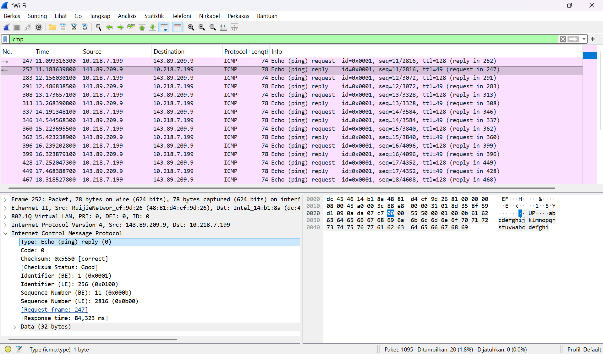
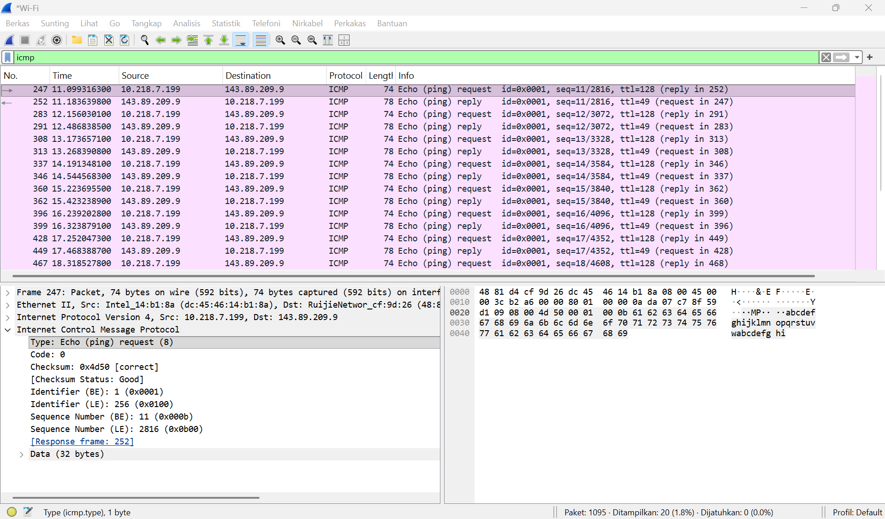
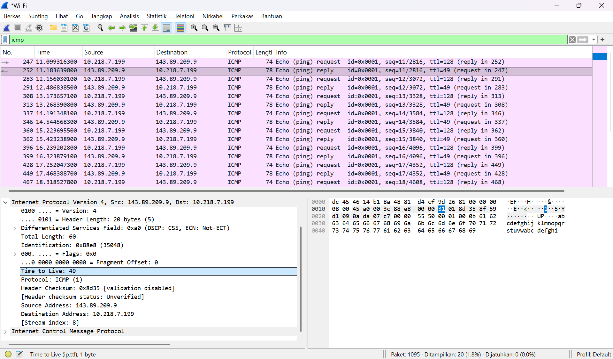
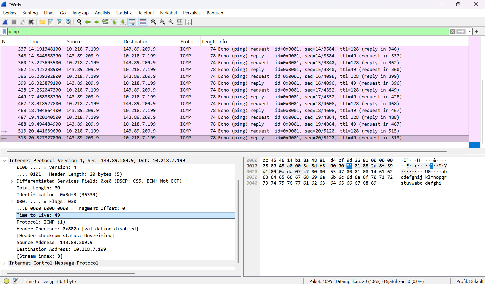
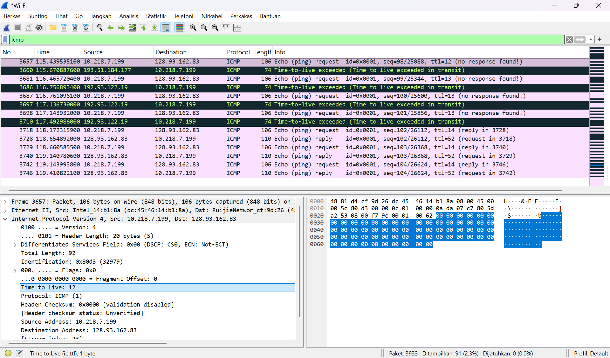
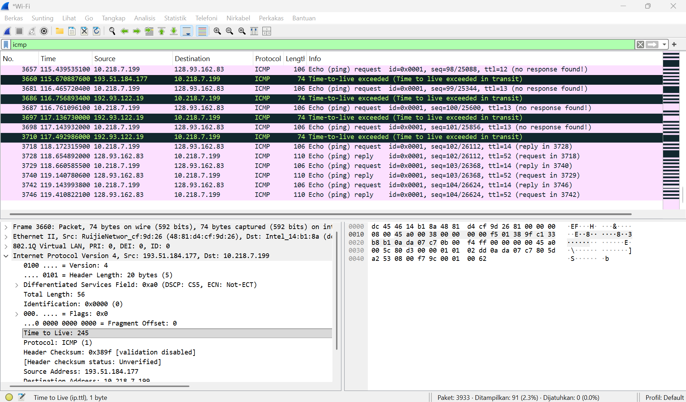

# Laporan Praktikum Modul 12 (ICMP)

Internet Control Message Protocol (ICMP) adalah protokol yang digunakan untuk membantu proses komunikasi dan pengecekan kondisi jaringan. ICMP sering digunakan oleh aplikasi seperti Ping dan Traceroute untuk memeriksa apakah suatu perangkat dapat dihubungi serta mengetahui jalur yang dilewati paket data menuju tujuan. Pada Ping, komputer mengirim pesan Echo Request dan menerima Echo Reply sebagai balasan. Sementara itu, Traceroute memanfaatkan nilai TTL (Time To Live) dan pesan Time Exceeded dari router untuk menampilkan rute yang dilalui paket dalam jaringan.

## Tujuan Praktikum
1. Dapat menginvestigasi cara kerja protokol ICMP menggunakan Wireshark

## Hasil Capture Wireshark

Pada gambar tersebut ditampilkan hasil perintah ping ke www.ust.hk dengan alamat IP 143.89.209.9, di mana komputer mengirimkan 10 paket dan seluruhnya berhasil diterima kembali tanpa adanya packet loss (0%). Setiap balasan menunjukkan ukuran data 32 bytes dengan nilai RTT yang bervariasi antara 74 ms hingga 353 ms dan rata-rata 160 ms, yang menunjukkan adanya perbedaan waktu tempuh akibat kondisi jaringan. Nilai TTL sebesar 49 menunjukkan bahwa paket telah melewati beberapa router sebelum mencapai tujuan

Pada gambar tersebut menunjukkan proses komunikasi ICMP antara komputer 10.218.7.199 dan server 143.89.209.9, di mana komputer mengirimkan paket Echo Request (Type 8) dan server membalas dengan Echo Reply (Type 0). Setiap paket request memiliki pasangan reply dengan sequence number yang sama, sehingga dapat diketahui bahwa setiap permintaan berhasil mendapatkan balasan yang berarti koneksi jaringan antara kedua host berjalan dengan baik tanpa adanya gangguan

Pada gambar tersebut menunjukkan paket ICMP Echo Reply (Type 0) dari server 143.89.209.9 ke komputer 10.218.7.199 sebagai balasan dari ping. Meskipun dari nomor frame yang berbeda yaitu 252 dan 515, keduanya masih merupakan bagian dari proses ping yang sama, hanya berbeda urutan pengiriman yang berarti setiap permintaan berhasil mendapatkan balasan sehingga koneksi jaringan berjalan dengan baik

Pada gambar tersebut menunjukkan paket ICMP dengan nilai TTL sebesar 12 yang dikirim dari komputer ke tujuan. Karena nilai TTL terlalu kecil, paket tidak berhasil mencapai tujuan dan berhenti di router perantara, sehingga muncul pesan “Time-to-live exceeded” yang menandakan bahwa paket masih dalam proses penelusuran jalur atau traceroute

Pada gambar tersebut menunjukkan paket ICMP balasan dari router dengan nilai TTL sebesar 245 yang dikirim kembali ke komputer. Nilai TTL yang besar menunjukkan bahwa paket berasal dari router perantara dan bukan dari tujuan akhir. Paket ini merupakan respon “Time-to-live exceeded” yang menandakan bahwa paket sebelumnya gagal mencapai tujuan karena TTL habis

## Kesimpulan
Dari praktikum ini, dapat disimpulkan bahwa protokol ICMP digunakan untuk menguji konektivitas jaringan melalui pertukaran paket Echo Request dan Echo Reply. Selain itu, melalui pengamatan di Wireshark juga terlihat bahwa nilai TTL mempengaruhi perjalanan paket dalam jaringan, di mana TTL kecil menyebabkan paket berhenti di router dan menghasilkan pesan “Time-to-live exceeded”