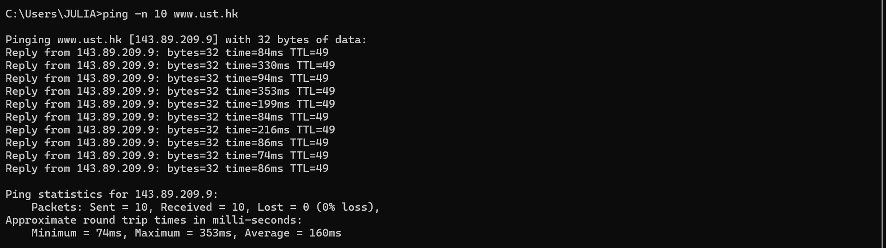

# Laporan Praktikum Modul 14 (802.11 WiFi)

IEEE 802.11 adalah standar jaringan WiFi yang memungkinkan komunikasi data tanpa kabel. Dalam jaringan ini, Access Point (AP) mengirimkan Beacon Frame untuk mengumumkan keberadaan jaringan, sedangkan Data Frame digunakan untuk mengirim data pengguna. Sebelum dapat berkomunikasi, perangkat harus melakukan proses Association dengan AP, dan koneksi dapat diakhiri melalui proses Disassociation.

## Tujuan Praktikum
1. Dapat menginvestigasi cara kerja WiFi menggunakan Wireshark

## Hasil Capture Wireshark

## Kesimpulan
