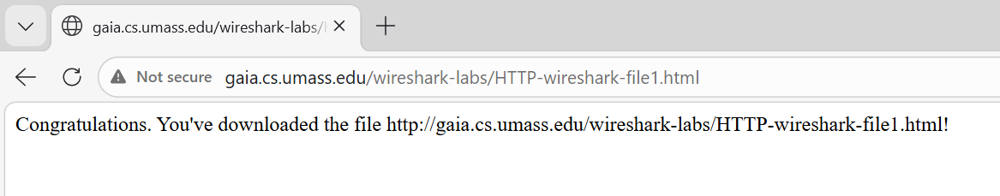

# Laporan Praktikum Modul 3 (HTTP)

## Tujuan Praktikum
1. Memahami cara kerja protokol HTTP menggunakan Wireshark
2. Mengamati proses request dan response pada HTTP
3. Memahami dasar autentikasi pada HTTP

HTTP (HyperText Transfer Protocol) adalah protokol yang digunakan untuk komunikasi antara browser (client) dan server web. Saat kita membuka website, browser akan mengirim HTTP Request (biasanya GET), lalu server akan membalas dengan HTTP Response yang berisi data halaman web

## Langkah Percobaan
### A. Basic HTTP GET/Response
1. Buka browser
2. Jalankan Wireshark
3. Klik start untuk mulai proses capture paket
4. Mengakses website
http://gaia.cs.umass.edu/wireshark-labs/HTTP-wireshark-file1.html

5. Menggunakan filter **http** untuk menampilkan paket HTTP saja

6. Mengamati paket yang tertangkap pada Wireshark
7. Stop capture

Berdasarkan hasil pengamatan menggunakan Wireshark, terlihat dua paket utama yaitu HTTP GET dari client ke server dan HTTP 200 OK sebagai respon dari server. Hal ini menunjukkan bahwa proses dasar HTTP berjalan dengan cara client meminta data dan server memberikan balasan berupa halaman web yang diminta. Dari sini dapat dipahami bahwa komunikasi HTTP bersifat request dan response

### B. HTTP Conditional GET
1. Hapus cache browser
2. Start capture Wireshark
3. Mengakses website
http://gaia.cs.umass.edu/wireshark-labs/HTTP-wireshark-file2.html
4. Menggunakan filter **http** untuk menampilkan paket HTTP saja
5. Refresh halaman
6. Stop capture

Pada percobaan ini, request kedua yang dikirim browser mengandung header If-Modified-Since. Jika data di server tidak mengalami perubahan, maka server tidak mengirim ulang data, melainkan hanya memberikan respon 304 Not Modified. Hal ini menunjukkan bahwa browser memanfaatkan cache untuk mempercepat akses dan menghemat penggunaan data, karena tidak perlu mendownload ulang file yang sama

### C. Retrieving Long Documents
1. Hapus cache
2. Start capture
3. Mengakses website
http://gaia.cs.umass.edu/wireshark-labs/HTTP-wireshark-file3.html
4. Menggunakan filter **http** untuk menampilkan paket HTTP saja
5. Stop capture

Saat mengakses file HTML yang panjang, hasil di Wireshark menunjukkan bahwa response dari server tidak dikirim dalam satu paket saja, melainkan terbagi menjadi beberapa segmen TCP. Hal ini terjadi karena ukuran file cukup besar sehingga harus dipecah agar dapat dikirim melalui jaringan. Dengan demikian, dapat disimpulkan bahwa HTTP bekerja bersama TCP untuk mengirim data dalam bentuk potongan-potongan kecil

### D. HTML dengan Embedded Objects
1. Hapus cache
2. Start capture
3. Mengakses website
http://gaia.cs.umass.edu/wireshark-labs/HTTP-wireshark-file4.html
4. Menggunakan filter **http** untuk menampilkan paket HTTP saja
5. Stop capture

Dari hasil pengamatan, ketika membuka halaman yang memiliki gambar, browser tidak hanya mengirim satu request, tetapi beberapa request tambahan untuk mengambil setiap objek (seperti gambar) yang terdapat pada halaman tersebut. Artinya, satu halaman web sebenarnya terdiri dari banyak resource yang harus diminta secara terpisah oleh browser agar halaman dapat ditampilkan secara lengkap

### E. HTTP Authentication
1. Hapus cache
2. Start capture
3. Mengakses website
http://gaia.cs.umass.edu/wireshark-labs/protected_pages/HTTP-wireshark-file5.html
4. Menggunakan filter **http** untuk menampilkan paket HTTP saja
5. Login :
- Username : wireshark-students
- Password : network
6. Stop capture

Pada percobaan autentikasi, terlihat adanya header Authorization: Basic yang berisi username dan password dalam bentuk encoding Base64. Meskipun terlihat seperti terenkripsi, sebenarnya data tersebut hanya diubah formatnya dan masih bisa dikembalikan ke bentuk aslinya. Hal ini menunjukkan bahwa HTTP biasa tidak aman untuk proses login karena informasi sensitif masih bisa dibaca oleh pihak lain jika disadap

## Kesimpulan
Dari praktikum ini, dapat disimpulkan bahwa HTTP bekerja dengan mekanisme request dan response antara client dan server. Selain itu, satu halaman web dapat terdiri dari banyak request karena adanya objek tambahan seperti gambar. Namun, HTTP memiliki kelemahan dalam hal keamanan, terutama pada proses autentikasi, karena data yang dikirim tidak terenkripsi dengan baik sehingga lebih aman menggunakan HTTPS